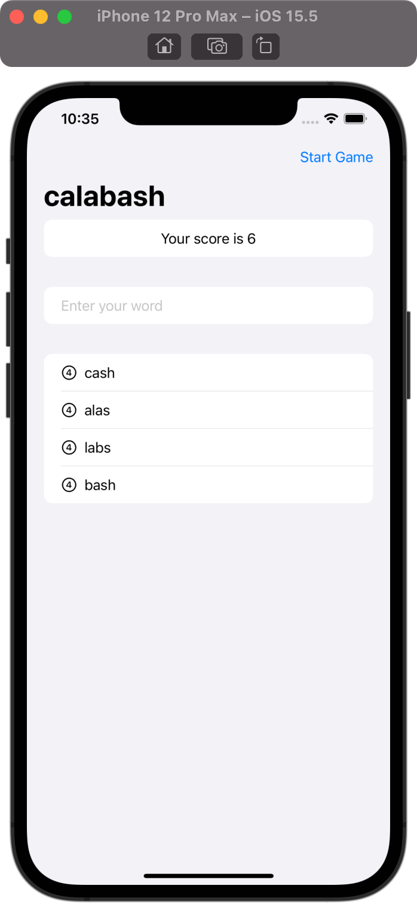

# WordScramble

## Project Description

The project is a part of 100 Days of SwiftUI curriculum by Paul Hudson [Hacking with swift](https://www.hackingwithswift.com/100/swiftui)

This project is a game. The game will show players a random eight-letter word, and ask them to make words out of it. For example, if the starter word is “alarming” they might spell “alarm”, “ring”, “main”, and so on.

- Answers that are shorter than three letters or are just our start word are disallowed.
- Users can restart with a new word whenever they want to.
- Text view tracks and shows the player’s score for a given root word. It involves a number of words and their letter count.

## Project Screen

